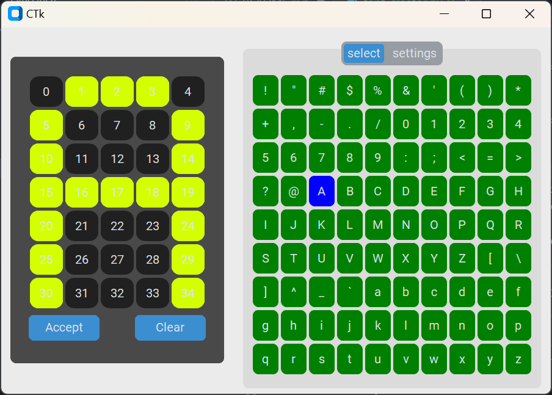

# Flip Dot Sign Controller

This is a flipdot sign controller using an ESP32. It currently uses the original sink drivers. All of this is parallel, using one I/O for each pin.

## Project Structure

```
your_project/
├── main.py
├── boot.py
├── lib/
│   ├── __init__.py
│   ├── flipper.py
│   ├── wifi_manager.py
│   ├── wifi_scan.py
├── config/
│   └── config.json
│   └── font1.json
├── README.md
├── requirements.txt
└── .gitignore
```

### Files Description

- **main.py**: The main entry point for the project. Initializes the flipdot display and WiFi connection.
- **boot.py**: Script that runs on boot-up.
- **lib/flipper.py**: Contains the `Display` class to control the flipdot display.
- **lib/wifi_manager.py**: Contains the `WifiManager` class to manage WiFi connections.
- **lib/wifi_scan.py**: Script to scan WiFi networks.
- **config/config.json**: Configuration file for WiFi credentials (ignored in git).
- **config/font1.json**: Font configuration for the flipdot display.
- **scripts/font_creator.py**: Script to create or modify the font configuration.
- **images/font_creator_screenshot.png**: Screenshot of the font creator in action.
- **.gitignore**: Specifies files and directories to be ignored by Git.

## Setup

### 1. Configuration

Create a `config.json` file in the `config` directory with your WiFi credentials:

```json
{
    "ssid": "your_ssid",
    "password": "your_password"
}
```

Add `config/config.json` to your `.gitignore` to prevent it from being tracked in version control:

```plaintext
config/config.json
```

### 2. Installation

1. **Clone the repository:**

    ```bash
    git clone https://github.com/yourusername/flip_dot_sign.git
    cd flip_dot_sign
    ```

2. **Install dependencies (if any):**

    ```bash
    pip install -r requirements.txt
    ```

3. **Upload the code to your ESP32:**

    Use your preferred method (e.g., `ampy`, `mpfshell`, `Thonny`) to upload the files to the ESP32.

### 3. Running the Project

1. **Power on the ESP32:**
   - The `boot.py` script will run automatically on boot-up.

2. **Connect to WiFi:**
   - The `main.py` script will read the WiFi credentials from `config/config.json` and attempt to connect to the specified network.

3. **Flipdot Display:**
   - The `main.py` script initializes the flipdot display and performs initial setup.

### 4. Creating or Modifying Fonts

**Use the Font Creator Script:**

The `scripts/font_creator.py` script is provided to create or modify the font configuration (`config/font1.json`).
Run the script with Python to generate the `font1.json` file.

```bash
python scripts/font_creator.py
```

**Font Creator in Action:**

Here’s a screenshot of the font creator in action:



### Todo

- [ ] Create a multiplexer with I2C to control each of the bits to set the dot. The write/erase will be an I/O connected to the controller still.
- [ ] Create a web server that works.
- [ ] Organize the files used for this project. There are too many different versions.

## Contributing

Feel free to submit issues or pull requests. For major changes, please open an issue first to discuss what you would like to change.

## License

This project is licensed under the MIT License.
